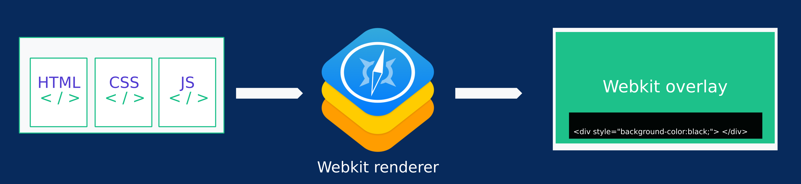
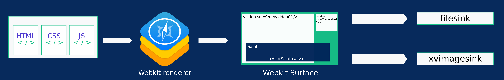

# Gst Webkit

Easiest way to build overlays with Gstreamer



Our goal is to develop a Webkit mixer providing javascript interactions.




Using webkit you can use all css animations, all javascript interactions. You don't need to code complex pipelines in c / python to do that.


You can use this gstreamer element to do :


## Installation

### Requirements

* libwebkit
* libcairo
* Gstreamer-1.0

### Compilation

```
apt-get install libwebkit-dev libcairo-dev
```

```
./autogen.sh
```

```
make
```

```
sudo make install
```

## Usage

```
Factory Details:
  Rank                     none (0)
  Long-name                WebkitSrc
  Klass                    Html / css / js renderer element
  Description              Html / css / js renderer element
  Author                   Ludovic Bouguerra <ludovic.bouguerra@kalyzee.com>

Plugin Details:
  Name                     webkitsrc
  Description              webkitsrc
  Filename                 /usr/local/lib/gstreamer-1.0/libgstwebkitsrc.so
  Version                  1.0.0
  License                  LGPL
  Source module            gst-webkit
  Binary package           Webkit
  Origin URL               http://www.kalyzee.com/

GObject
 +----GInitiallyUnowned
       +----GstObject
             +----GstElement
                   +----GstBaseSrc
                         +----GstPushSrc
                               +----GstWebkitSrc

Pad Templates:
  SRC template: 'src'
    Availability: Always
    Capabilities:
      video/x-raw
                 format: { (string)RGBA }
                  width: { (int)1280 }
                 height: { (int)720 }
              framerate: { (fraction)25/1 }

Element has no clocking capabilities.
Element has no URI handling capabilities.

Pads:
  SRC: 'src'
    Pad Template: 'src'

Element Properties:
  name                : The name of the object
                        flags: accès en lecture, accès en écriture
                        String. Default: "webkitsrc0"
  parent              : The parent of the object
                        flags: accès en lecture, accès en écriture
                        Object of type "GstObject"
  blocksize           : Size in bytes to read per buffer (-1 = default)
                        flags: accès en lecture, accès en écriture
                        Unsigned Integer. Range: 0 - 4294967295 Default: 4096
  num-buffers         : Number of buffers to output before sending EOS (-1 = unlimited)
                        flags: accès en lecture, accès en écriture
                        Integer. Range: -1 - 2147483647 Default: -1
  typefind            : Run typefind before negotiating (deprecated, non-functional)
                        flags: accès en lecture, accès en écriture, obsolète
                        Boolean. Default: false
  do-timestamp        : Apply current stream time to buffers
                        flags: accès en lecture, accès en écriture
                        Boolean. Default: false
  url                 : url page
                        flags: accès en lecture, accès en écriture
                        String. Default: null

```


Test pipeline

```
GST_DEBUG=*webkit*:5 gst-launch-1.0 webkitsrc url=http://localhost/test.html ! video/x-raw, format=RGBA, framerate=25/1, width=1280, height=720 ! videoconvert ! xvimagesink sync=FALSE

```


```
GST_DEBUG=*webkit*:5 gst-launch-1.0 webkitsrc url=http://localhost/test.html ! video/x-raw, format=RGBA, framerate=25/1, width=1280, height=720 ! videoconvert ! xvimagesink sync=FALSE

```


TODO 
```
GST_DEBUG=*webkit*:5 gst-launch-1.0 videotestsrc ! video/x-raw, format=ARGB, width=1280, height=720 ! mixer.sink_0 \
  webkitsrc  url="http://localhost/test.html" ! video/x-raw, format=RGB, width=1280, height=720 ! alpha method=green ! mixer.sink_1 \
  videomixer name=mixer sink_0::zorder=0 sink_1::zorder=1 ! \
  videoconvert ! autovideosink sync=FALSE
```
